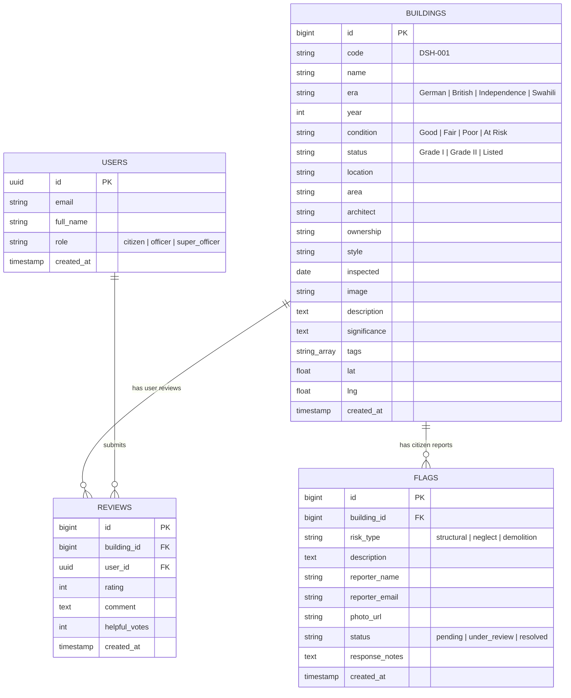

# Deliverable 1: Requirements & Design Document

**Project Title**: Digital Inventory and Virtual-Tour System for Dar es Salaam Heritage Buildings  
**Project ID**: Project 13  
**Domain**: Cultural Heritage  
**Type**: Software  
**Target Duration**: 15 Weeks  
**Primary Data Owner & Administrator**: Antiquities Department (Tanzania)  
**Stakeholders & Partners**: DARCH (Dar es Salaam Centre for Architectural Heritage), National College of Tourism, ARU Architecture Department  

---

## 1. Executive Summary & Background

Dar es Salaam’s historic built fabric—spanning German colonial (1887–1916), British colonial (1916–1961), Swahili, and early independence-era (1961+) structures—is facing rapid loss due to urban redevelopment, structural neglect, and unregulated demolition. Prior to this software project, heritage site inventories existed primarily in paper format at the Antiquities Department, rendering them outdated, physically inaccessible to the public, and inadequate for legal protection enforcement.

The **Urithi Majengo System** delivers a comprehensive, web-based, georeferenced digital inventory integrated with interactive 360° panoramic virtual tours, citizen risk reporting, and a restricted Antiquities Department officer dashboard.

---

## 2. Stakeholders & User Roles

| Stakeholder / User Role | Description & Primary Function |
| :--- | :--- |
| **Antiquities Department Officers** | Primary system administrators and data owners. Responsible for creating, updating, inspecting, and managing official building records and responding to citizen risk reports. |
| **DARCH (Heritage Advocacy Partner)** | Advocates for architectural preservation; uses system records for public education and conservation campaigns. |
| **National College of Tourism** | Promotes cultural heritage tourism; utilizes 360° virtual tours for educational and promotional initiatives. |
| **ARU Architecture Department** | Academic research partner; accesses georeferenced records, structural condition ratings, and architectural styles for research. |
| **General Public & Tourists** | Explores Dar es Salaam’s heritage through interactive map views, building details, video libraries, and 360° virtual tours. |
| **Authenticated Citizens** | Submits reviews, star ratings, and reports at-risk structures undergoing unauthorized alteration or demolition threats. |

---

## 3. Functional Requirements

### 3.1 Georeferenced Digital Inventory (Deliverable 2 Baseline)
- **FR-1.1**: The system shall store georeferenced coordinates (`lat`, `lng`) for each heritage building in Dar es Salaam.
- **FR-1.2**: Each building record shall store architectural attributes: name, code (`DSH-XXX`), era (*German Colonial, British Colonial, Swahili, Independence*), year built, style, architect, legal protection status (*Grade I Listed, Grade II Listed, Listed*), ownership (*Government, Public, Private*), structural condition (*Excellent, Good, Fair, Poor, At Risk*), inspection date, and historical significance description.
- **FR-1.3**: The system shall automatically generate sequential building codes (e.g. `DSH-001`, `DSH-002`, `DSH-014`).

### 3.2 Public Web Portal & Virtual Tours (Deliverable 3 Baseline)
- **FR-2.1**: The public portal shall render an interactive map view (Leaflet.js) displaying building markers color-coded by condition.
- **FR-2.2**: The system shall provide search and filter capabilities by keyword, era, condition, district, and legal status.
- **FR-2.3**: Each building record shall embed an interactive 360° equirectangular panoramic virtual tour (Pannellum.js) with drag-to-look, zoom, and fullscreen controls.
- **FR-2.4**: Authenticated citizens shall be able to submit risk reports (*Report At-Risk*) detailing structural threats, neglect, or demolition notices with optional photo uploads.

### 3.3 Restricted Officer Portal (Deliverable 4 Baseline)
- **FR-3.1**: The officer portal shall require JWT-based authentication with role access controls (*Officer*, *Super Officer*).
- **FR-3.2**: Officers shall have full CRUD (Create, Read, Update, Delete) access over heritage building records.
- **FR-3.3**: Officers shall have a live-updating dashboard auto-refreshing every 5 seconds, presenting key performance indicators (total buildings, pending flags, Grade I count, community reviews).
- **FR-3.4**: Officers shall be able to review, triage, update status (*Pending* → *Under Review* → *Resolved*), and append resolution notes to citizen flag reports.

---

## 4. System Architecture Diagram

```
                                ┌─────────────────────────────┐
                                │     Web Browser Client      │
                                │   (Public & Officer UI)     │
                                └──────────────┬──────────────┘
                                               │ HTTP / JSON REST API
                                               ▼
                                ┌─────────────────────────────┐
                                │   Express.js Node Backend   │
                                │   (REST Routes & Auth API)  │
                                └──────────────┬──────────────┘
                                               │ `@supabase/supabase-js`
                                               ▼
                                ┌─────────────────────────────┐
                                │  Supabase PostgreSQL DB     │
                                │   & Native Auth / Storage   │
                                └─────────────────────────────┘
```

---

## 5. Entity-Relationship Diagram (ERD)



---

## 6. Use-Case Diagrams

```mermaid
usecaseDiagram
    actor PublicUser as "Public / Tourist / Researcher"
    actor Citizen as "Authenticated Citizen"
    actor Officer as "Antiquities Officer"

    PublicUser --> (View Interactive Map)
    PublicUser --> (Search & Filter Buildings)
    PublicUser --> (View Building Details & History)
    PublicUser --> (Explore 360° Virtual Tour)

    Citizen --> (Submit At-Risk Flag Report)
    Citizen --> (Write Building Review & Rating)

    Officer --> (Log In to Restricted Portal)
    Officer --> (Add / Edit / Delete Building Records)
    Officer --> (Auto-Generate Building Codes)
    Officer --> (Review & Resolve At-Risk Flags)
    Officer --> (Monitor Live Dashboard Metrics)
```

---

## 7. Wireframes & Layout Specifications

### 7.1 Public Web Portal Layout (`HTML/index.html` & `HTML/buildings.html`)
- **Top Navigation Bar**: Brand Logo (*Urithi Majengo*), Navigation Links (*Map & Records, All Buildings, At-Risk Reports, Community, Officer Portal*), and Search Input.
- **Hero Section**: Key stats counter (*Total Inventory, Protected Sites, Active Virtual Tours, Community Reports*).
- **Georeferenced Map View**: Full-width interactive Leaflet map container displaying color-coded status markers with popup summary cards.
- **Building Directory Grid**: 3-column card grid rendering building thumbnail, condition badge, era pill, 360° virtual tour tag, and quick modal trigger.
- **Building Detail Modal**: Tabbed view (*Overview*, *360° Virtual Tour*, *Community Reviews*) with architectural meta tiles (*Architect, Ownership, Style, Last Inspected*).

### 7.2 Restricted Officer Portal Layout (`HTML/officer.html`)
- **Metric Cards Row**: Real-time counter widgets displaying live counts of *Total Buildings*, *Pending At-Risk Flags*, *Nationally Listed Sites*, and *Community Reviews*.
- **Building Management Data Table**: Filterable table showing Building Code, Name, Era, Condition, Status, Coordinates, and Action buttons (*Edit*, *Delete*).
- **Add / Edit Modal**: Form supporting auto-code generation (`DSH-XXX`), era pickers, condition selectors, lat/lng entry, image URL, and 360° panorama URL input.
- **Flag Resolution Workstation**: Table listing incoming threat reports with status dropdowns (*Pending*, *Under Review*, *Resolved*) and officer notes input.
